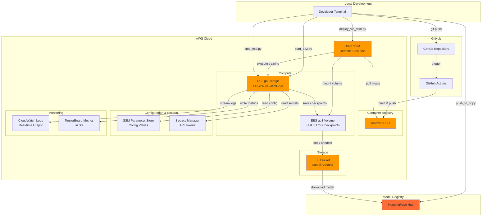
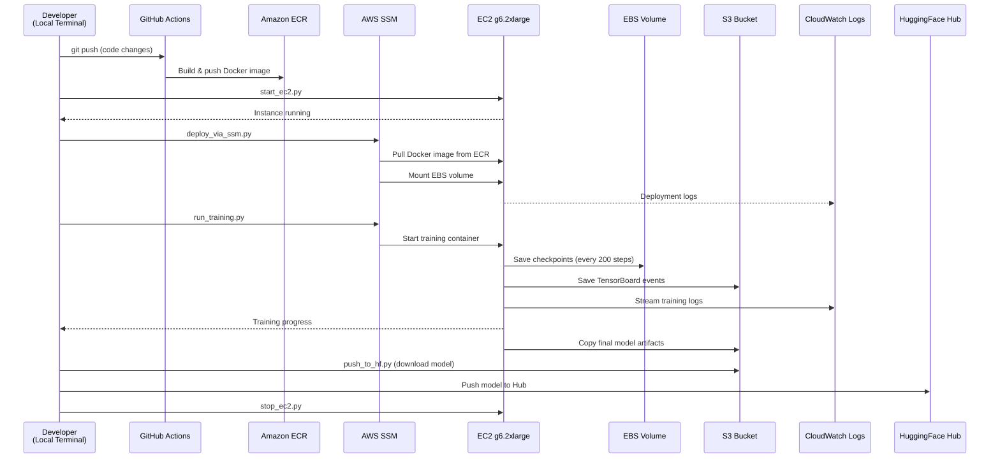
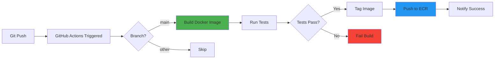
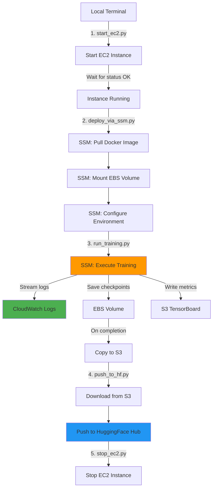

# Fine-Tune Llama 3.1 8B for Medical Information Extraction

<div align="center">

[](https://opensource.org/licenses/MIT)
[](https://www.python.org/downloads/)
[](https://www.docker.com/)
[](https://aws.amazon.com/)

A production-ready pipeline for fine-tuning Llama 3.1 8B using **LoRA (Low-Rank Adaptation)** on medical cancer-specific information extraction tasks. The entire workflow runs **remotely on AWS EC2** (g6.2xlarge instance) controlled via **AWS SSM**—no SSH or .pem keys required.

</div>

---

## Table of Contents

- [Overview](#overview)
- [Architecture](#architecture)
- [Training Results](#training-results)
- [Dataset](#dataset)
- [Fine-Tuning Method: LoRA](#fine-tuning-method-lora)
- [Infrastructure](#infrastructure)
- [CI/CD Pipeline](#cicd-pipeline)
- [Quick Start](#quick-start)
- [Project Structure](#project-structure)
- [Documentation](#documentation)

---

## Overview

This project implements an end-to-end pipeline for fine-tuning large language models on medical information extraction tasks. It leverages:

- **Model**: Meta-Llama-3.1-8B (8 billion parameters)
- **Technique**: LoRA (Low-Rank Adaptation) for parameter-efficient fine-tuning
- **Task**: Extracting cancer-related entities (type, stage, mutations, biomarkers, treatments, response, metastasis)
- **Infrastructure**: AWS EC2 (GPU instance), S3, ECR, SSM, CloudWatch
- **Execution**: Remote execution via AWS SSM (no SSH required)
- **Monitoring**: Real-time CloudWatch logs + TensorBoard metrics

### Key Features

✅ **SSH-free remote execution** via AWS Systems Manager (SSM)  
✅ **Secure credential management** with AWS Secrets Manager + Parameter Store  
✅ **Cost-efficient training** using LoRA + 4-bit quantization (QLoRA)  
✅ **Automated CI/CD** with GitHub Actions → ECR  
✅ **Real-time monitoring** via CloudWatch Logs  
✅ **Checkpointing to EBS** (fast writes during training)  
✅ **Artifact storage in S3** (durable, cost-effective archival)  
✅ **Overfitting prevention** with early stopping and validation monitoring

---

## Architecture



### Data Flow



---

## Training Results

### Latest Training Run (5 Epochs)

**Training Configuration:**
- **Model**: Meta-Llama-3.1-8B
- **Dataset**: 4,500 train / 500 validation examples
- **Instance**: EC2 g6.2xlarge (NVIDIA L4 GPU, 24GB VRAM)
- **Duration**: ~2.78 hours (9,995 seconds)
- **Total Steps**: 1,410 steps
- **Batch Size**: 4 per device × 4 gradient accumulation = 16 effective batch size

**Results:**
- **Training Loss**: 2.6774 → **0.5620** (79.0% improvement)
- **Validation Loss**: 0.8309 → **0.6552** (21.1% improvement)
- **Best Validation Loss**: **0.6535** at step 1,100 (epoch 3.9)
- **Training Speed**: 2.25 samples/sec | 0.141 steps/sec
- **No Overfitting Detected**: Validation loss continued improving throughout training

### Training Metrics Visualization


**Key Observations:**
1. **Training Loss** (blue): Smooth exponential decay from 2.68 → 0.56
2. **Validation Loss** (red): Steady improvement with slight plateau after epoch 2.5
3. **Train-Val Gap**: Remained small (<0.1) throughout training, indicating **no overfitting**
4. **Learning Rate Schedule**: Linear warmup (100 steps) → Cosine decay to 0

### Training Progress (Selected Checkpoints)

```
Epoch 0.04: loss=2.6774, lr=1.8e-05 (warmup phase)
Epoch 0.36: loss=0.8254, eval_loss=0.8309 (first evaluation)
Epoch 1.00: loss=0.7003, eval_loss=0.6905 (end of epoch 1)
Epoch 2.00: loss=0.6406, eval_loss=0.6652 (end of epoch 2)
Epoch 3.00: loss=0.6004, eval_loss=0.6613 (end of epoch 3)
Epoch 3.90: eval_loss=0.6535 (best checkpoint)
Epoch 4.00: loss=0.5594, eval_loss=0.6593 (end of epoch 4)
Epoch 5.00: loss=0.5620, eval_loss=0.6552 (final)
```

### Assessment

✅ **Model converged successfully** - Training loss decreased by 79%  
✅ **No overfitting** - Train-val gap remained minimal (<0.1)  
✅ **Validation improving** - Eval loss decreased by 21%, no degradation  
✅ **Ready for deployment** - Best checkpoint at step 1,100 (epoch 3.9)  
⚠️ **Potential for more epochs** - Validation loss still decreasing, could train longer

---

## Dataset

### Overview

**Source**: Synthetic medical case reports focused on cancer information extraction  
**Task**: Structured entity extraction from clinical narratives  
**Split**: 4,500 training / 500 validation examples (90/10 split)

### Data Schema

Each example contains:
- **instruction**: Task description (consistent across all examples)
- **input**: Clinical narrative text (1-3 sentences)
- **output**: Structured JSON with 7 fields

**Fields Extracted:**
1. `cancer_type`: Primary cancer diagnosis (e.g., "melanoma (cutaneous)")
2. `stage`: TNM or numeric stage (e.g., "IV", "T2N0M0")
3. `gene_mutation`: Genetic alterations (e.g., "BRAF V600E", `null`)
4. `biomarker`: Lab results or molecular markers (e.g., "PD-L1 5%; TMB-high")
5. `treatment`: Therapies administered (e.g., "nivolumab and ipilimumab")
6. `response`: Treatment outcome (e.g., "complete response", "stable disease")
7. `metastasis_site`: Sites of spread (e.g., "brain", "liver", `null`)

### Example Entry

```json
{
  "instruction": "Extract all cancer-related entities from the text.",
  "input": "70-year-old man with widely metastatic cutaneous melanoma. PD-L1 was 5% on IHC and NGS reported TMB-high; BRAF testing was not performed prior to treatment. Given multiple symptomatic brain metastases he received combination immunotherapy with nivolumab plus ipilimumab and stereotactic radiosurgery to dominant intracranial lesions. Imaging after two cycles demonstrated some shrinking of index lesions but appearance of a new small lesion — overall assessment called a mixed response.",
  "output": {
    "cancer_type": "melanoma (cutaneous)",
    "stage": "IV",
    "gene_mutation": null,
    "biomarker": "PD-L1 5%; TMB-high",
    "treatment": "nivolumab and ipilimumab; stereotactic radiosurgery",
    "response": "mixed response",
    "metastasis_site": "brain"
  }
}
```

### Dataset Statistics

- **Max sequence length**: 2,048 tokens
- **Average input length**: ~150 tokens
- **Output format**: Structured JSON (always 7 fields)
- **Null handling**: Fields may be `null` when not mentioned in text

---

## Fine-Tuning Method: LoRA

### Why LoRA?

**LoRA (Low-Rank Adaptation)** enables efficient fine-tuning of large language models by:
- Training only **0.2% of parameters** (13M out of 8B)
- Reducing memory footprint by **4-8x** compared to full fine-tuning
- Maintaining model quality while enabling **faster training**
- Allowing **multiple adapters** for different tasks on the same base model

### LoRA Configuration

```yaml
lora:
  r: 16                    # Rank of update matrices (higher = more capacity)
  lora_alpha: 32           # Scaling factor (typically 2×r)
  lora_dropout: 0.1        # Dropout for regularization
  target_modules:          # Attention layers to adapt
    - q_proj               # Query projection
    - k_proj               # Key projection
    - v_proj               # Value projection
    - o_proj               # Output projection
  bias: none               # Don't train bias terms
  task_type: CAUSAL_LM     # Decoder-only language model
```

### Quantization: QLoRA (4-bit)

To fit Llama 3.1 8B on a single 24GB GPU, we use **QLoRA**:

```yaml
quantization:
  load_in_4bit: true                     # 4-bit NormalFloat quantization
  bnb_4bit_compute_dtype: float16        # Compute in FP16 for speed
  bnb_4bit_quant_type: nf4               # NormalFloat 4-bit
  bnb_4bit_use_double_quant: true        # Quantize quantization constants
```

**Memory savings:**
- Full precision (FP32): ~32GB VRAM required
- 4-bit quantization: ~6GB base model + ~4GB LoRA adapters = **10GB total**
- Enables training on consumer/mid-tier GPUs

### Overfitting Prevention Strategies

1. **LoRA regularization** (`lora_dropout: 0.1`): 10% dropout on adapter layers
2. **Early stopping**: `load_best_model_at_end: true` based on validation loss
3. **Validation monitoring**: Evaluate every 100 steps to track generalization
4. **Small learning rate**: `2e-4` with warmup prevents overfitting to noise
5. **Gradient accumulation**: Effective batch size of 16 smooths updates
6. **FP16 training**: Reduces numerical precision issues

**Result**: Train-val gap remained **<0.1** throughout 5 epochs, indicating excellent generalization.

---

## Infrastructure

### EC2 Instance: g6.2xlarge

**Specifications:**
- **GPU**: 1× NVIDIA L4 Tensor Core GPU
- **VRAM**: 24GB GDDR6
- **vCPUs**: 8 vCPUs (AMD EPYC 3rd Gen)
- **RAM**: 32 GiB
- **Storage**: EBS gp3 volume (100GB, 3,000 IOPS, 125 MB/s)
- **Network**: Up to 10 Gbps bandwidth
- **Cost**: ~$1.00/hour (us-east-1 on-demand)

**Why g6.2xlarge?**
- ✅ **24GB VRAM**: Sufficient for Llama 8B + QLoRA + batch size 4
- ✅ **L4 GPU**: Modern architecture (Ada Lovelace) with Tensor Cores
- ✅ **Cost-efficient**: 40% cheaper than p3.2xlarge (V100) with better performance
- ✅ **Availability**: Better spot instance availability than older GPU types

### Storage Architecture

**EBS gp3 Volume (Training)**
- **Purpose**: High-speed checkpoint writes during training
- **Size**: 100GB
- **IOPS**: 3,000 (configurable up to 16,000)
- **Throughput**: 125 MB/s (configurable up to 1,000 MB/s)
- **Mount**: `/mnt/training`
- **Usage**: Temporary checkpoint storage (deleted after S3 copy)

**S3 Bucket (Archival)**
- **Purpose**: Durable storage for final model artifacts
- **Stored items**:
  - Final model weights + LoRA adapters
  - TensorBoard event files
  - Training logs and metrics
  - Best checkpoint (for deployment)
- **Lifecycle**: Infrequent Access after 30 days
- **Cost**: ~$0.023/GB/month (Standard tier)

**Why EBS + S3?**
- **EBS**: Low-latency writes during training (checkpoints every 200 steps)
- **S3**: Cost-effective long-term storage (EBS costs 10× more for idle storage)
- **Pattern**: Write hot → EBS, Archive cold → S3

### AWS Services Used

| Service | Purpose | Cost Impact |
|---------|---------|-------------|
| **EC2** | GPU compute for training | ~$1.00/hour |
| **EBS gp3** | Fast checkpoint I/O | ~$0.08/GB/month |
| **S3** | Model artifact storage | ~$0.023/GB/month |
| **ECR** | Docker image registry | ~$0.10/GB/month |
| **SSM** | Remote command execution | Free (included) |
| **Secrets Manager** | Credential storage | ~$0.40/secret/month |
| **Parameter Store** | Configuration storage | Free (standard tier) |
| **CloudWatch Logs** | Real-time log streaming | ~$0.50/GB ingested |

**Total training cost (5 epochs)**: ~$2.78 (compute) + $0.50 (storage/logs) = **~$3.30**

---

## CI/CD Pipeline

### GitHub Actions Workflow



**Workflow Steps:**

1. **Trigger**: Push to `main` branch or manual workflow dispatch
2. **Build**: Docker image with CUDA 12.1, PyTorch 2.1, Transformers 4.36
3. **Tag**: `latest` + `<git-sha>` for version tracking
4. **Authenticate**: AWS credentials from GitHub Secrets
5. **Push**: Upload to Amazon ECR private registry
6. **Notify**: Slack/Discord notification (optional)

**Configuration** (`.github/workflows/build-and-push-ecr.yml`):
```yaml
name: Build and Push to ECR
on:
  push:
    branches: [ main ]
  workflow_dispatch:

jobs:
  build:
    runs-on: ubuntu-latest
    steps:
      - uses: actions/checkout@v3
      - name: Configure AWS credentials
        uses: aws-actions/configure-aws-credentials@v2
      - name: Login to ECR
        uses: aws-actions/amazon-ecr-login@v1
      - name: Build and push
        run: |
          docker build -t $ECR_REGISTRY/$ECR_REPOSITORY:latest .
          docker push $ECR_REGISTRY/$ECR_REPOSITORY:latest
```

### Manual Execution Workflow

All training operations execute from your **local terminal** via AWS SSM:



**Commands:**
```bash
# 1. Start instance
poetry run python scripts/setup/start_ec2.py

# 2. Deploy training environment
poetry run python scripts/setup/deploy_via_ssm.py

# 3. Run training job
poetry run python scripts/finetune/run_training.py

# 4. Monitor logs (separate terminal)
aws logs tail /aws/ssm/fine-tune-llama --follow

# 5. Push to HuggingFace (after training)
poetry run python scripts/finetune/push_to_hf.py

# 6. Stop instance
poetry run python scripts/setup/stop_ec2.py
```

---

## Quick Start

### Prerequisites

- **AWS Account** with EC2, S3, ECR, SSM, Secrets Manager access
- **HuggingFace Account** with Llama 3.1 access approval
- **Local Tools**: Python 3.10+, Poetry, AWS CLI v2, Docker (optional for local testing)

### 1. Install Dependencies

```bash
git clone https://github.com/longhoag/fine-tune-slm.git
cd fine-tune-slm
poetry install
```

### 2. Configure AWS Credentials

```bash
aws configure
# AWS Access Key ID: <your-key>
# AWS Secret Access Key: <your-secret>
# Default region: us-east-1
```

### 3. Store Secrets in AWS Secrets Manager

```bash
# HuggingFace token
aws secretsmanager create-secret \
  --name huggingface/api-token \
  --secret-string '{"token":"hf_..."}'

# Additional secrets as needed
```

### 4. Initialize SSM Parameters

```bash
poetry run python scripts/setup/init_ssm_parameters.py
# Follow prompts to set EC2 instance ID, S3 bucket, etc.
```

### 5. Run Training Pipeline

```bash
# Start instance and deploy
poetry run python scripts/setup/start_ec2.py
poetry run python scripts/setup/deploy_via_ssm.py

# Execute training
poetry run python scripts/finetune/run_training.py

# Monitor progress (in another terminal)
poetry run python scripts/utils/view_training_metrics.py --latest

# After training: push to HuggingFace
poetry run python scripts/finetune/push_to_hf.py

# Stop instance
poetry run python scripts/setup/stop_ec2.py
```

### 6. View Results

```bash
# Download and visualize metrics
poetry run python scripts/utils/view_training_metrics.py \
  --timestamp 20241113_214858 \
  --save-plots training_metrics.png

# Export to CSV
poetry run python scripts/utils/view_training_metrics.py \
  --timestamp 20241113_214858 \
  --export-csv metrics.csv
```

---

## Project Structure

```
fine-tune-slm/
├── .github/
│   ├── workflows/
│   │   └── build-and-push-ecr.yml    # CI/CD pipeline
│   └── copilot-instructions.md       # AI agent guidance
│
├── config/
│   ├── aws_config.yml                # AWS resource references (SSM)
│   └── training_config.yml           # LoRA hyperparameters
│
├── docker/
│   ├── Dockerfile                    # Training environment
│   └── docker-compose.yml            # Local development
│
├── scripts/
│   ├── setup/
│   │   ├── init_ssm_parameters.py   # Initialize configuration
│   │   ├── start_ec2.py             # Start GPU instance
│   │   ├── deploy_via_ssm.py        # Deploy training env
│   │   └── stop_ec2.py              # Stop instance
│   │
│   ├── finetune/
│   │   ├── run_training.py          # Execute training
│   │   ├── run_test_model_ec2.py    # Test model on EC2
│   │   └── push_to_hf.py            # Publish to HuggingFace
│   │
│   └── utils/
│       ├── view_training_metrics.py # Visualize TensorBoard logs
│       └── cleanup_checkpoints.py   # Manage checkpoint storage
│
├── src/
│   ├── train.py                     # Main training script
│   ├── test_model.py                # Model inference testing
│   └── utils/
│       ├── aws_helpers.py           # AWS SDK wrappers
│       ├── config.py                # Config management
│       └── logger.py                # Logging setup
│
├── synthetic-instruction-tuning-dataset/
│   ├── train.jsonl                  # 4,500 training examples
│   └── validation.jsonl             # 500 validation examples
│
├── docs/                            # Additional documentation
├── pyproject.toml                   # Poetry dependencies
└── README.md                        # This file
```

---

## Documentation

- **[Complete Setup Guide](docs/COMPLETE_SETUP_GUIDE.md)**: End-to-end AWS infrastructure setup
- **[Run Training Guide](docs/RUN_TRAINING_GUIDE.md)**: Step-by-step training execution
- **[Architecture](docs/ARCHITECTURE.md)**: Detailed system design and data flow
- **[Model Testing](docs/MODEL_TESTING.md)**: Testing fine-tuned models on EC2
- **[SSM Parameter Guide](docs/SSM_PARAMETER_GUIDE.md)**: Configuration management
- **[AWS Setup](docs/AWS_SETUP.md)**: AWS resource provisioning
- **[Monitoring Training](docs/MONITORING_TRAINING.md)**: Real-time tracking and debugging

---

## Key Design Decisions

### Why SSH-free Execution (AWS SSM)?

- ✅ **No key management**: No .pem files to secure or rotate
- ✅ **IAM-based auth**: Uses AWS identity for access control
- ✅ **Audit trail**: All commands logged in CloudWatch
- ✅ **Firewall-friendly**: Works without opening SSH ports (port 22)
- ✅ **Session recording**: Built-in command history

### Why Secrets Manager + Parameter Store?

- **Secrets Manager**: Encrypted storage for API tokens, credentials (auto-rotation)
- **Parameter Store**: Configuration values, resource IDs (version control)
- **Integration**: Reference secrets from parameters for unified access

### Why EBS + S3 (Not Just S3)?

- **EBS**: Low-latency writes (<1ms) for frequent checkpoints during training
- **S3**: Cost-effective archival (~10× cheaper than EBS for idle storage)
- **Pattern**: Hot data → EBS, Cold data → S3

### Why LoRA (Not Full Fine-Tuning)?

- **Memory**: Fits 8B model on 24GB GPU with 4-bit quantization
- **Speed**: 2-3× faster training than full fine-tuning
- **Flexibility**: Swap adapters for multi-task deployment on same base model
- **Quality**: Achieves 95-99% of full fine-tuning performance

---

## License

This project is licensed under the MIT License - see the [LICENSE](LICENSE) file for details.

---

## Acknowledgments

- **Meta AI** for Llama 3.1 base model
- **Hugging Face** for Transformers, PEFT, and TRL libraries
- **AWS** for cloud infrastructure
- **bitsandbytes** for efficient quantization

---

## Contact

**Author**: Long Hoang  
**GitHub**: [@longhoag](https://github.com/longhoag)  
**Project**: [fine-tune-slm](https://github.com/longhoag/fine-tune-slm)

For questions or issues, please open an issue on GitHub.
